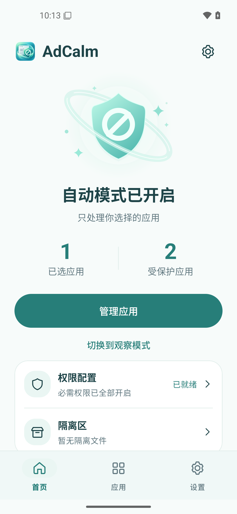

# AdCalm

Android 常驻工具，自动处理打开 App 时的开屏/弹窗广告。

- 识别广告弹窗上**正确的**关闭按钮并点击
- 被错误跳转或触发下载时，回退并清理
- **其余用户自用的软件和后台一律不操作**

> 定位是自用侧载工具。因为使用无障碍服务 + 所有文件访问权限，不可能上架任何应用商店。

<p align="center">
  
</p>

---

## 仓库概览

```
.
├─ app/                        # 应用模块
│   └─ src/
│       ├─ main/               # 主源码（53 个 Kotlin 文件，约 8700 行）
│       ├─ test/               # 单元测试（纯逻辑，不需要设备）
│       └─ androidTest/        # 仪器测试（需要真机/模拟器）
├─ .github/                    # CI 工作流与 issue 模板
├─ docs/
│   ├─ 前作调研.md              # 从 GKD / 论文 / ad-skipper 学到了什么
│   ├─ 手机UI优化说明.md         # 界面改版记录
│   ├─ 界面.png                 # 主界面截图
│   └─ artwork/                # 图标源文件与生成说明
├─ .toolchain/                 # 工具链（约 3.4GB，已 gitignore）
├─ build.sh / env.sh           # 构建入口，零绝对路径
├─ gradlew / gradle/           # Gradle wrapper
└─ README.md / LICENSE / CHANGELOG.md / CONTRIBUTING.md
```

源码按职责分目录，**判定逻辑与 Android API 严格隔离**：

```
app/src/main/java/cn/adcalm/guard/
├─ model/       纯数据结构（NodeSnapshot / Candidate / RectSnapshot）
├─ core/        判定逻辑 —— 全部是纯函数，不接触任何 Android 类
├─ rules/       规则模型与加载
├─ ocr/         ML Kit 封装与截屏
├─ shizuku/     shell 通道
├─ service/     三个服务（无障碍 / 通知监听 / 前台）
├─ data/        观察日志与隔离区
└─ ui/          界面
```

这条分界是刻意的：**判定逻辑只接收纯数据**，因此打分、规则匹配、哨兵判定、隔离判定、
扫描节奏、点击冷却、shell 命令构造都能用构造的假数据做单元测试，不需要真机。
目前 215 个单测覆盖的就是这几块——也是最容易出错、后果最重的那几块。

需要说明的是：`core/` 是**按职责**分的，不是按"是否碰 Android"分的，所以它里面
也放着权限检查、设置读写、节点树读取这些必须接触系统 API 的东西（22 个文件里有 9 个）。
纯的那些是：`ConfidenceScorer` / `CountdownTracker` / `CloseButtonFinder` / `Sentinel` /
`DownloadFilter` / `OcrCloseScorer` / `ScanPolicy` / `ClickCooldown` / `ShellCommands` /
`ClickGate` / `AccessibilityBinding` / `AppRecommender` / `AdPackageCleaner`，
外加整个 `rules/` 和 `model/`。这条边界目前靠约定维持，没有在编译期强制。

---

## ⚠ 分享与法律风险（请先读这一节）

**这一节是事实陈述，不是免责声明。** 免责声明在最后，但你应该先知道风险在哪。

### 同类的先例

2023 年 8 月，「李跳跳」作者收到某互联网大厂的律师函，指控其违反《反不正当竞争法》，随后宣布**无限期停止更新并下架**。叮小跳、大圣净化、一指禅等同类软件收到同一公司的律师函，同样下架。[光明网](https://m.gmw.cn/toutiao/2023-08/30/content_1303498686.htm)、[中新网](https://www.chinanews.com.cn/gsztc/2023/08-30/10069260.shtml)

**这一节早先写的是「这件事止于律师函，没有走到法院判决」——那是错的。** 2024 年起已有生效判决，而且不止一起：

| 案件 | 结果 |
|---|---|
| 芒果TV 诉「拦精灵」 | 北京知识产权法院 **(2024)京73民终463号**，2024-04-17 二审当庭宣判驳回上诉、维持原判，判赔**经济损失 8 万 + 合理开支 1 万** |
| 芒果TV 诉「广告拦截助手」 | 长沙中院二审维持，判赔 **15 万** |
| 深圳某视频 App 诉某自动跳过软件 | 深圳中院二审维持，判赔 **8 万**（2024-11 发布） |

来源：[北京知识产权法院](https://bjzcfy.bjcourt.gov.cn/article/detail/2024/04/id/7903050.shtml)、[中国知识产权律师网](https://www.ciplawyer.cn/articles/153396.html)、[湖南法院](http://hngy.hunancourt.gov.cn/article/detail/2024/04/id/7909788.shtml)。

**判决的推理路径值得逐字看。** 芒果TV 案二审认定「拦精灵」**实际上对开屏广告页面实施了屏蔽**，依据是：在案取证视频显示开屏广告**多次未能显示**，与「拦精灵」自称仅「跳过」不符，且其未能合理解释。据此认定构成《反不正当竞争法》第十二条第二款第四项的不正当竞争。

所以**「跳过还是屏蔽」这条线是法院自己划的——而且它不是按软件怎么自称划的，是按广告实际上有没有展示划的。**

### 但有一项区分对我们有利

芒果TV 案二审判决里那句限定语，是这类工具目前唯一的立足点：

> 跳过开屏广告软件的功能**应仅限于替代用户点击「跳过」**，不能直接屏蔽开屏广告；若实质屏蔽，则不具正当性。

也就是说，**「过滤」和「跳过」确实应当作不同的法律评价**：

- **过滤**让广告根本不再呈现，直接减损广告曝光与计费
- **跳过**只是代替用户点击**平台自己设置的**跳过按钮，广告的展示链路与计费逻辑都没有被改变

本项目属于后者：不拦截网络请求、不修改任何数据、不绕过任何技术措施，只做「找到屏幕上已经存在的按钮并点它」。这不是免疫，但是一个实质性的区别。

**但要看清这条线的性质：它是按事实认定的，不是按声明认定的。** 「拦精灵」也自称只做跳过，法院是看取证视频里广告到底显示了没有。由此有两点需要记住：

1. 这项抗辩成立与否取决于**实际行为**，声明怎么写改变不了它；
2. 本项目里有两项功能**不在「代替用户点屏幕上已有的按钮」这个描述之内**——**强停别的应用**（直接中断对方进程）和**下载拦截 / 隔离区**（移走对方下载的文件）。它们比点击跳过按钮离那条线更远。它们的价值是真实的（同类的工具确实不做），但风险评价也应当分开看，不能跟着「跳过」一起算。

### 关于免责声明：你原本设想的写法是错的

你提到想写「仅供学习，不可商用，用户行为与作者无关」。这三点各有问题：

**「仅供学习」往往是反向信号。** 这个措辞在中文互联网上大量出现在破解、逆向类项目里，被普遍理解为「这东西本身可能不太合法」。写在首页不会给你避风港，反而在描述这个项目的性质。

**「不可商用」与标准开源协议直接冲突。** MIT、Apache-2.0、GPL 都允许商用。如果你同时声明开源协议又写「禁止商用」，两者效力存疑。中国司法实践已明确：在 (2021)最高法知民终2063号案中，法院认定 GPL3.0 具有合同性质，且 **GPL3.0 并不限制商用**，作者单方声明「商用需另行授权」不能改变协议约定。

**「用户行为与作者无关」有一定作用但有限。** 它能说明你没有教唆、没有从中获利，但**不能阻断**权利人直接来找你——李跳跳的作者也没有从中获利，一样收到了律师函。这类纠纷解决路径很多时候根本不是诉讼，而是一封要求你下架的函。

> 真正有意义的不是声明怎么写，而是**项目本身有多"针对性"**。下一节说这个。

### 真正能降低风险的四件事

按有效性排序：

**1. 不要点名具体的公司或广告 SDK。** 这是本项目里风险最集中的一处，现已处理——默认规则库**故意留空**。一份标注了具体厂商 SDK 类名的规则文件，读起来就是一份"针对特定厂商广告"的靶向清单。项目的立足点是"在用户自己的设备上，找到屏幕上已经存在的按钮并点它"，保持内容中性是这条界线的一部分。

（顺带说明：那些规则在技术上也从未被证实有效，删除不损失任何功能。详见 `builtin.json` 里的注释。）

**2. 只发布代码，不要发布 APK。** 提供可直接安装的成品会显著抬高暴露度。李跳跳的模式是「产品 + 下载站」，GKD 的模式是「GitHub 代码仓库 + 用户自行构建」，后者的处境明显更从容。

**3. 不要有任何形式的盈利。** 不接广告、不做捐赠激励、不提供付费支持。免费非盈利是抗辩「是否属于经营者」的核心事实，一旦盈利这个抗辩基本就没了。

**4. 项目名和描述保持中性。** 不要用「干掉广告」「对抗某厂」这类表述，不要在主页点名任何公司。

### 关于开源本身

**开源是可以的，而且比闭源分发安全。** GKD（GPL-3.0）在 GitHub 上公开，数千 star，未听闻法律纠纷；而李跳跳面临律师函的那个版本并没有开源。

开源带来的两个额外好处：代码可审计（能证明确实不联网、不上传数据），以及责任边界更清晰（使用者自己构建、自己承担）。

### 最后

**我不是律师，以上不构成法律意见。** 如果你的项目可能被关注、或者你打算在境内公开推广，请咨询执业律师。上面这些能帮你判断风险量级，替代不了一个专业人士看过你的具体情况后的意见。

---

## 免责声明

- 本项目为**个人自用工具**，用于在自有设备上自动点击界面上**已经存在的**按钮。它不拦截网络请求、不修改任何应用的数据或逻辑、不绕过任何技术保护措施、不破解任何软件。
- 本项目**核心功能不联网**——广告识别、判定、点击全程离线，**飞行模式下可完整运行**。
  唯一的联网动作是你主动点击的「下载并安装 Shizuku」按钮（从 GitHub 官方仓库取最新版）。
  除此之外不收集、不上传任何数据。这条承诺有代码层面的约束：整个源码里只有
  `ShizukuInstaller.kt` 这一个文件发起网络请求，往别处加网络调用之前请先改这段说明。
- 本项目**不提供任何担保**，包括但不限于对功能、稳定性、数据安全的担保。使用风险由使用者自行承担。
- 使用者应自行确认其使用行为符合所在地区的法律法规及各应用的服务条款。**因使用本项目产生的任何后果由使用者自行承担。**
- 作者**不鼓励、不支持**任何商业用途，也未从中获得任何形式的利益。
- 作者**不提供**针对特定厂商或特定软件的定制支持。

## 许可证

[GPL-3.0](LICENSE)。

选择它的理由：任何人都可以自由使用、修改、商用，但**衍生作品必须同样开源**。这能防住真正该防的事——有人把代码拿去做成闭源商业产品。注意 GPL **不禁止商用**，这是它的定义决定的；想要"禁止商用"就不再是开源协议了。

---

## 当前进度

| 阶段 | 内容 | 状态 |
|---|---|---|
| 0 | 工具链 + 工程骨架 + 可编译 APK | ✅ 完成 |
| 1 | 无障碍服务 + 打分引擎 + 观察模式日志 + 界面 | ✅ 完成 |
| 2 | 规则库 | ✅ 框架完成，**默认故意留空**（合规红线，理由见下） |
| 3 | 启发式打分调优 | ✅ 完成（2026-10-05 用 2094 + 2552 条真机日志全量校准） |
| 4 | 点击执行 + 冷却 + 哨兵回滚 | ✅ 完成 |
| 5 | 误跳检测 + 无 root 强停 | ✅ 完成，**强停文案表待按 ROM 校准** |
| 6 | 下载拦截 + 隔离区 | ✅ 完成 |
| 7 | OCR 兜底（Canvas 绘制的关闭按钮） | ✅ 完成 |
| 8 | 保活 + ROM 适配 + 统计 | 🟡 下载监控已并入无障碍服务（开机自动拉起，不再有常驻通知）；首页「今日已跳过」统计已完成；**ROM 自启动图文指引待做** |

**默认即为自动点击模式。** 装好、授权、勾选应用之后就会开始工作。

**观察模式是「纯观察」**：只记录识别结果，不点击、不回退、不强停，也不移动下载目录里的文件。它是排查手段——觉得漏点或误判时切过去跑一段，看日志里它到底瞄准了哪里、打了多少分。自动模式下的风险由三道闸门兜底：只有已勾选的应用会被介入、跨不过 65 分不点、误跳后有哨兵回退。

还剩下的不确定性有一处：**强停按钮的文案表**按多个 ROM 整理过，但只在一种 ROM 上做过真机验证。默认规则库是空的，所以它不构成不确定性（为什么不填，见上文「分享与法律风险」）。

APK 约 **20MB**，其中 OCR 的 native 库占大头（`libmlkit_google_ocr_pipeline.so` 一个就 10MB）。
`abiFilters` 只保留 `arm64-v8a`：x86 / x86_64 只有模拟器用得上；32 位的 `armeabi-v7a`
2026-10-05 也去掉了，再省约 6.5MB。**要装到 32 位设备上，把 `"armeabi-v7a"` 加回
`app/build.gradle.kts` 的 `abiFilters`**；要在模拟器上跑就加 `x86_64`（或构建时加
`-PwithEmulatorAbi`）。

---

## 真机验证状态

**2026-10-03 在某国产机型（Android 12 / arm64）上完成首次运行验证。**
下表里的数字按 2026-10-05 的状态更新过。

已确认可用的部分：

| 项目 | 验证方式 |
|---|---|
| 无障碍服务能连接并读到其他应用的节点树 | 真机日志：读到几个主流应用的窗口 |
| `takeScreenshot` 返回可读位图 | OCR 在真实截图上识别出 47 个文本块 |
| ML Kit 中文模型加载与识别 | 合成图识别 + 真机截图识别 |
| 整条 L1→L2→L3 链路 | 节点树无候选 → 截屏 → OCR → 判定，全链路执行 |
| `dispatchGesture` 手势点击 | 两次点击成功（`via GESTURE`） |
| `FileObserver` 文件监控 | 真机日志：`下载监控已启动，覆盖 24 个目录` |
| 误跳回退 | 日志中出现过 `ROLLBACK` |
| 应用列表枚举 | 列出 122 个应用（此前因 `MATCH_DEFAULT_ONLY` 只显示 20 个） |
| 行为保护名单 | 识别出 70 个用户实际在用的应用 |
| 单元测试 | 274 个通过 |
| 仪器测试 | 13 个在真机上通过 |

**这一条后来补上了**（2026-10-05）：把 2094 条和 2552 条真机观察日志全量分析过，
按「节点里有没有指向关闭按钮的证据」分开，界线非常干净——**有证据的 11 次点击 11 次全中**；
只有位置证据的 16 次里 15 次落在非广告界面。后一条数据就是「位置不是证据」那道闸门的由来。

### 诊断工具有个已知缺陷，已修

诊断模式原本只在**窗口切换时**抓节点树——但真机日志证明那正好错过最需要的一刻：**广告的关闭按钮是在窗口切换之后才异步渲染出来的**。结果某个浏览器里那个 `:id/closeIv`（开发者亲手命名为 close 的控件）一次都没被捕捉到。

现在只要发现了疑似以上的候选也会抓一份，并对重复候选做了 3 秒去重（此前同一个静止候选在 3 秒内被记录 20 次，日志没法看）。

### 一个待确认的问题：广告 SDK 类名可能根本不出现 → **已确认，而且比这个问题本身更严重**

29 份真机节点树里**一个广告 SDK 的类名都没有**。后续在真机上抓到完整广告之后确认了原因：
广告 SDK 常常把整个广告**画在画布上**，无障碍树里只留一层占位壳子，于是
「按容器类名匹配」「按 viewId 匹配」「按文本语义匹配」三条路**同时失效**。
**唯一还剩信息的是几何**（它开在哪儿、多大）。

这也是默认规则库基本留空的又一个理由：按 `containerClass` 写的规则很可能一条都不可达，
留着只会显示一个虚假的覆盖率。这类广告现在靠 OCR 兜底处理（见「判定逻辑」一节）。

---

## 构建

```bash
cd <项目目录>
./build.sh                      # 编译 Debug APK
./build.sh testDebugUnitTest    # 只跑单元测试
./build.sh connectedDebugAndroidTest   # 在已连接的真机/模拟器上跑仪器测试
```

`build.sh` 和 `env.sh` **不含任何写死的绝对路径**：项目根目录由脚本自身位置推导，SDK/Gradle/JDK 优先用项目内 `.toolchain/` 下的，找不到就退回系统环境变量。

### ⚠ 克隆下来之后：先准备工具链

**本仓库不含 `.toolchain/`**（约 3.4GB 的 SDK + Gradle + JDK，已在 `.gitignore` 里），
所以 `git clone` 之后**不能直接跑 `./build.sh`**。两种办法：

**办法一：用系统上已有的工具链**

| 需要 | 版本 | 说明 |
|---|---|---|
| JDK | 17 或更高 | `env.sh` 找不到项目内 JDK 时会用 `PATH` 上的 `java`。实际构建用的是 21，源码兼容级别定在 17 |
| Android SDK | platform **35** + build-tools | 缺了会报 `SDK location not found` |
| Gradle | 不用管 | 由 `gradlew` 自动下载（落到 `.toolchain/gradle-home`） |

SDK 的位置用环境变量 `ANDROID_HOME` 指定，或者在项目根目录写一个 `local.properties`：

```properties
sdk.dir=/path/to/Android/sdk
```

**办法二：把工具链放进项目里**（和作者的环境一致）

在项目根目录建 `.toolchain/`，按下面的结构放，`env.sh` 会自动使用：

```
.toolchain/
├─ sdk/          # ANDROID_HOME 指向这里，需要 platform 35
├─ gradle-8.9/   # 可选，仅用于离线
└─ jdk/          # 可选，JAVA_HOME 指向这里
```

`.toolchain/` 在 `.gitignore` 里，放进去的东西不会被提交。

### ⚠ 两个坑

**`connectedAndroidTest` 跑完会卸载应用。** Gradle 会把它自己装的 APK 卸掉，**连应用数据一起清空**。在一台已经配好的手机上跑之前，先备份设置：

```bash
adb exec-out run-as <包名> cat shared_prefs/adcalm.xml > adcalm.xml.bak
adb exec-out run-as <包名> cat files/observer_log.jsonl > observer_log.jsonl.bak
```

**项目路径含中文时需要绕一下。** JVM 的类加载器加载不了含中文字符的类路径条目（单元测试 worker 会报 `ClassNotFoundException`），Windows 上还有一批 native 工具（aapt2 等）对非 ASCII 路径处理不干净。

`env.sh` 和 `app/build.gradle.kts` 都会**自动检测**：路径含非 ASCII 时切到同级的 ASCII 目录联接上构建，产物也重定向到纯 ASCII 路径。需要先建一个联接：

```bash
cmd //c "mklink /J <上级目录>\adcalm <项目真实目录>"
```

正常 ASCII 路径的项目完全不受影响，走标准的 `build/` 目录——这段逻辑是刻意写成运行时检测而不是写死路径的。

---

## 相关项目

这个项目不是凭空的，动手前调研过同类方案。**从每一处学到了什么、哪些采纳了、哪些刻意没采纳**，都记在 [docs/前作调研.md](docs/前作调研.md) 里。

一句话版本：如果目标是"尽可能多地跳过广告"，用 [GKD](https://github.com/gkd-kit/gkd)——它的社区规则库覆盖 863 个应用，这个数据优势本项目追不上。本项目存在的理由是另外两件事：**广告把你拽走之后能收拾干净**（哨兵回退 + 强停），以及**下载下来的安装包能拦下来**。这两块 GKD 不做。

> ⚠ **不要同时运行两个跳广告工具。** 它们都是无障碍服务，会同时对同一个广告作出反应——互相抢着点，甚至重复点击。如果装了 GKD 或类似工具，请只保留一个的无障碍权限。

---

## 安装与首次配置

```bash
# 产物路径见上文「构建」一节（Windows 上项目路径含中文时，会被重定向到同级的 adcalm-build/）
adb install -r app/build/outputs/apk/debug/app-debug.apk
```

装好后打开 App，按主界面的「授权状态」逐项开启。**Android 13 及以上会拦截侧载应用的无障碍权限**：

1. 先点「去开启无障碍服务」，勾选时会提示「受限设置，此设置当前不可用」
2. 回到「设置 → 应用 → AdCalm → 右上角 ⋮ → 允许受限设置」
3. 再回去开启无障碍服务
4. 不要在有电话打进来的时候操作（Android 16 会禁止通话中开启无障碍）

其余几项按同样方式开启：

| 权限 | 不开启的后果 |
|---|---|
| 通知使用权 | 下载通知取消失效，广告下载只能靠强停应用来打断 |
| 使用情况访问 | **行为保护名单失效**，界面会显示「受保护的 App 数：加载中…」，此时程序保守地拒绝强停任何应用 |
| 所有文件访问 | 隔离区失效，退化成"只拦截不清理" |
| 电池优化白名单 | 后台被杀，无法持续工作 |

前两项建议务必开启——尤其「使用情况访问」，它失效时程序会进入保守状态，强停功能等于关掉了。

---

## 使用流程

1. **选范围**：主界面 →「选择要处理的 App」。列表支持**全选 / 反选 / 清空**——但**作用面越小越安全，也越省电**，建议只勾确实有开屏广告的那几个。**没勾的 App 本工具完全不介入**。

   懒得一个个挑的话，主界面「管理应用」下面有个**「广告软件更新」**：它按本机观察日志里出现过的广告判定次数推荐；**刚装上、日志还空着时**，改按「这 7 天用得最久的应用」推荐，并在确认框里如实说明那只是代理指标。**结果是加入，不会取消你已经勾好的**。判据全部来自本机数据，不用任何外部应用清单。
2. **它就开始工作了**。默认是自动点击模式。

   首页那行「今天已跳过 N 次」用来分辨**「没效果」和「根本没在跑」**：如果是 0、而它上面那行「当前状态」是正常的，说明今天确实没碰到广告；如果「当前状态」本身是警示色，那是服务没挂上，点它去配置。
3. **看日志**：主界面 →「导出日志」。用电脑取走：
   ```bash
   adb pull /sdcard/Android/data/cn.adcalm.guard/files/observer_log.jsonl
   ```
   每行一条 JSON，记录了每次窗口变化时所有候选按钮的分数和加减分理由。`decision` 字段说明当时做了什么：`CLICKED` 是已点击、`SUSPECT_ONLY` 是「拿不准、没点」、`ROLLBACK` 是「检测到误跳并回退」。
4. **发现误判就切观察模式**：设置页里打开「观察模式」——它是**纯观察**，只记录、不点击也不回退；看日志确认问题所在，调整后再切回自动。
5. **看隔离区**：如果日志里出现 `ROLLBACK`，去隔离区看看有没有被拦下来的安装包，可以逐个恢复或删除。

### 找不到关闭按钮怎么办

打开「诊断模式」（主界面「行为」区）。它会把**所有**前台应用（不限勾选范围）的完整节点树写进日志，包括每个节点的 id、文本、类名、位置。

然后复现一次广告，导出日志。日志里 `decision` 为 `TREE_DUMP` 的行就是那一刻的完整界面结构，照着它就能补出精确规则。

诊断模式日志量很大，排查完记得关掉。

---

## 判定逻辑

### 三级识别

- **L1 规则库**：按 `包名 / 包名数组 / Activity / 广告SDK容器` + `viewId / 文本 / contentDescription` 匹配
- **L2 启发式打分**：见下表
- **L3 OCR 兜底**：针对 Canvas 绘制的关闭按钮（见下方「L3：OCR 兜底」）

### 规则库：默认故意为空

`app/src/main/assets/rules/builtin.json` 的 `rules` 数组**默认是空的**。这是刻意的决定，不是遗漏。

**原因一（合规，主要）**：规则文件如果点名具体的广告 SDK 类名，读起来就是一份"针对特定厂商广告"的靶向清单。项目的立足点是"在用户自己的设备上，找到屏幕上已经存在的按钮并点它"——保持内容中性是这条界线的一部分。有一条仪器测试守着这个约束。

**原因二（技术）**：没有证据表明这类规则有用。曾经的 48 条规则里没有任何一条使用验证过的精确 viewId，全是模糊匹配，本质上在重复启发式已经在做的事。而且它们还**引入过一个真 bug**——规则分原本是与启发式**相加**的，"规则命中(+55)"会和"文案匹配(+55)"叠成 110，足以把任何位置的同名文字推过 65 分线；实测后果是 115 个应用里**屏幕正中央的「跳过」也变成了可点击目标**。

现在规则分与启发式分**取最大值，不相加**：

```kotlin
val finalScore = if (ruleScore != null) maxOf(heuristicScore, ruleScore) else heuristicScore
```

这意味着规则必须**自己站得住**：一条 70 分的规则可以独立触发点击，一条 55 分的弱规则最多只能把候选抬到"疑似"档进入日志，借不了启发式的力。有专门的回归测试钉住这一点。

**本应用的实际识别能力来自启发式打分（文本语义 + 位置 + 倒计时）与 OCR 兜底，不依赖这个文件。留空不影响任何功能。**

#### 想自己写规则的话

一条硬性要求：**规则必须从你自己设备的真实数据里得出，不要凭猜、不要抄别人的 viewId。**

步骤是：打开诊断模式 → 复现一次广告 → 导出日志 → 找 `decision=TREE_DUMP` 的行 → 从里面读真实结构。先确认广告容器的 `ancestors` 里有哪个类名，再找同一容器内跳过按钮的 viewId 片段，两者都确认了才写成规则。

格式：

```jsonc
{
  "name": "给这条规则起个名字",
  "containerClass": "容器类名——节点祖先链里含它时规则才生效",
  "targets": [
    { "type": "id_contains", "value": "viewId 片段", "score": 70 }
  ],
  "blacklist": ["命中即否决的 viewId 片段"]
}
```

`pkg` / `pkgs` / `activity` / `containerClass` 四项中**至少要有一项**——没有任何作用域的规则会被直接忽略，因为一条全局规则会把判定逻辑套用到所有应用的所有界面。`targets` 的 `type` 可取 `id_exact` / `id_contains` / `text_exact` / `text_contains` / `desc_contains`。

任何规则**必须至少限定一项作用域**（`pkg` / `pkgs` / `activity` / `containerClass`），否则会被判定为危险的全局规则直接忽略。

### 打分表

正向：规则命中（50~70，按规则给分）· `+55` 关闭语义文案且可点击面积小 · `+45` 倒计时递减 · `+45` 位于较大容器的角上 · `+45` viewId 含 skip/close · `+20` 位于屏幕四角 · `+20` 位于屏幕顶部且文案或描述写着关闭（与上一条二选一）· `+10` 同层有广告容器 · `+10` contentDescription 含关闭语义

负向：`−100` 面积超屏幕 35%（整屏热区陷阱）· `−60` 含诱导下载文案 · `−40` 位于屏幕中央 · `−30` 三位以上纯数字 · `−15` 位于 WebView 内且无任何关闭语义

**门限：≥65 才点击；40~64 只记日志不点；<40 忽略。**

单选一样证据都跨不过线，这是刻意的。各类典型组合：

| 证据组合 | 得分 | 结果 |
|---|---|---|
| 关闭文案 + 屏幕角落 | 75 | 点击 |
| `跳过 3` + 屏幕角落 | 75 | 点击（不必等倒计时跳动） |
| 倒计时 + 屏幕角落 | 65 | 点击 |
| viewId(skip/close) + 容器角落 | 90 | 点击 |
| viewId(skip/close) + 屏幕角落 | 65 | 点击 |
| 屏幕角落 + 容器角落（无文本的横幅叉） | 65 | **疑似，不点击**——见下方「位置不是证据」 |
| viewId(skip/close) 单独 | 45 | 疑似 |
| 容器角落 单独 | 45 | 疑似 |

### 位置不是证据：65 分之后还有一道闸门

**分数达标不等于可以动手。**

2026-10-04 晚的 784 条真机日志里，27 次点击有 14 次落在根本不是广告的界面上——某短视频应用的拍摄页、看图片页、账号选择页，某游戏社区应用的发帖编辑页和 Flutter 页，某旅行应用首页。其中一次点中了某短视频应用登录页右上角的「帮助」，**页面真的被跳走了**，随后又在帮助页上连点两次。

把那 27 次按「节点里有没有指向关闭按钮的证据」分开，界线非常干净：

| 证据 | 次数 | 结果 |
|---|---|---|
| 关闭语义（文案 / id / 描述）或观测到倒计时递减 | 11 | **11 次全中** |
| 只有位置（屏幕角落 20 + 容器角落 45 = 正好 65） | 16 | 15 次落在非广告界面 |

问题出在**那两个位置分相加正好等于点击线**：`+20 位于屏幕角落安全区` 加 `+45 位于较大容器的角上` = 65。于是「它在一个角落里」这一条事实单独就能触发点击，不需要任何东西佐证「这个角落是广告的角落」。而任何界面都有控件待在角落里：某短视频应用的标签栏、游客页的「帮助」、帖子编辑框的提交按钮。

现在 `ClickGate` 把这条堵死：**没有关闭语义、没有倒计时、也没有规则命中的候选，一律不点击**，只降级为 `SUSPECT` 写进日志，判定记为 `HELD_NO_EVIDENCE`。分数和理由照记，所以「它本来想点哪里」这个信息没丢，只是不对它动手。

代价说清楚：那 16 次里大约有 1 次是真的（某浏览器的开屏广告，它的关闭按钮确实只有几何特征）。也就是说这条规则**牺牲约 6% 的真阳性，换 15 次误点归零**。

> 更温和的方案试过，不成立。「只在开屏语境下放行」的两个判据都坏了：**「刚切换过窗口」**在诊断模式下几乎永远为真（稳态慢扫时也在写 TREE_DUMP，日志里根本重建不出这个信号）；**「应用刚成为前台」**区分不了**冷启动**和**从后台切回来**——只有冷启动才弹开屏广告，而从别的应用切回某短视频应用时一到前台就是正常信息流。
>
> **想处理只有几何特征的广告，请写规则。** 规则命中会被算作自带证据，可以独立触发点击，这也正是 GKD 那套「引擎与规则分离」的做法：通用的猜测部分收得越紧越好，个案的确定性交给有据可查的规则。

`ClickGate` 还挡另外一类：**输入法窗口在前台时一律不点**（判定 `HELD_INPUT_METHOD`）。关闭按钮不可能长在输入法窗口里，这条没有歧义；它对 OCR 那条路更要紧——2026-10-03 的日志里，OCR 把**输入法的「关闭」键**认成了关闭按钮，得了 80 分。

### 点击冷却只对"同一个位置"生效

本意是防连点同一个按钮。但真机日志暴露出它挡错了对象：某浏览器那次先点了一个 65 分的空白节点（**没关掉广告**），一秒后真正的倒计时按钮出现了，却被冷却连着挡了两次——

```
20:34:11  CLICKED   score=65  bounds=[966,2256,1038,2328]  ← 点错了地方
20:34:12  COOLDOWN  score=65  text='4'    ← 真按钮出现，被挡
20:34:13  COOLDOWN  score=65  text='3'    ← 又被挡
20:34:14  CLICKED   score=65  text='2'    ← 3 秒后才点到
```

**白白多等 3 秒。** 现在冷却只作用于同一位置的元素：换了位置说明上一次点错了或没生效，应该立刻能点。另外保留一条 400ms 的全局硬间隔，防止在多个候选之间来回点。逻辑抽在 `ClickCooldown` 里，是纯类，有单测钉住边界。

### 真机上广告关闭按钮长什么样

从 190 条真机日志里统计出来的形态，供校准参考：

| 应用 | 元素 | 位置 | 尺寸 |
|---|---|---|---|
| 某票务应用 | `id/tv_main_splash_skip` | 右上 [876,150,1020,225] | 144×75 |
| 某票务应用 | `id/tv_skip`（同位置的另一层） | 右上 [864,150,1008,225] | 144×75 |
| 某浏览器 | 裸倒计时数字 | 右上 [986,133,1002,176] | 16×43 |
| 某浏览器 | 裸倒计时数字 | 右上 [986,133,1002,176] | 16×43 |
| 某地图应用 | 文本 `跳过 02` | 右上 | — |
| 某浏览器 | 无文本无 id 的小方块 | 右下 [966,2256,1038,2328] | 72×72 |

**位置高度集中在右上角**（x 870~1020，y 130~230），这也解释了为什么"屏幕角落"这一条权重值 20 分——它是真机上最稳定的信号。

另外注意到一个细节：**同一个跳过按钮会在节点树里出现三层**（`tv_main_splash_skip`、`tv_skip`、`fl_skip_wrong`），其中 `fl_skip_wrong` 是广告 SDK 自己命名的**诱饵**（字面意思"错误的跳过"）。诱饵没有位置加分，停在 45 分的疑似档——我们的打分表天然把它和真按钮区分开了。

### 这套分值是拿真机数据校准的

第三轮校准（2026-10-03，108 条真机日志）的触发点是用户反馈「有些广告关不掉」。日志显示 80 次自动模式事件里只点成功 3 次，而**一批真关闭按钮密集卡在 55~60 分**：

| 得分 | 应用 | 线索 |
|---|---|---|
| 60 | 某浏览器 | `id='…:id/closeIv'` — 开发者亲手命名为 close |
| 55 | 某浏览器 | `[870,117,1038,192]` 顶部右角，无文本 |
| 55 | 某旅行应用 | `[1041,1978,1080,2134]` 底部右角，无文本 |

两处系统性偏低：

- **viewId 关键词原本只给 25 分**。一个由开发者命名为 `closeIv` 的控件是**明确的意图声明**，证据强度远高于此。提到 40 后，`closeIv` + 容器角落 = 85 能点；而单独一个含 close 的 id 只有 40，仍停在疑似档——抬权重没有把安全性搭进去，有专门的反向测试钉住。
- **两个独立位置信号相加只有 55**（屏幕角落 20 + 容器角落 35）。位置恰恰是横幅关闭叉唯一的线索，容器角落提到 45 后两者叠加正好 65。

上面表格里 某浏览器和某旅行应用那两个坐标已直接写成回归测试。

两处容易踩的坑，都是真机日志暴露出来后改的：

- **WebView 惩罚**原本是无条件的 `−50`。结果整个界面都是 WebView 的应用（某地图应用、大量资讯类 App）所有候选被打死，连真正的"跳过"按钮都翻不了身。现在它只作用于"没有任何关闭语义的可点击节点"，也就是广告里的内容链接。
- **候选节点有 16 像素的最小边长门槛**。真机日志里出现过 1×1 像素的"可点击"节点，那是布局噪声，点不到也没有意义。

### 第二轮真机日志暴露出来的四处

拿 `observer_log.jsonl`（46 条记录、覆盖几个主流应用）逐条比对后修正的，不是凭直觉调的：

- **`跳过 3` 这类写法匹配不上。** 只认精确的"跳过"三个字，而国内 App 的跳过按钮基本都带倒计时数字。结果第一次看到时只有 20 分（疑似），得等倒计时跳动一整秒后才被 `CountdownTracker` 认出来——**用户感知就是"关闭很慢"**。现在加了文案归一化：剥掉尾部倒计时数字再比对，第一次出现就能点。
- **「位于较大容器的角上」加分（+35）条件太松。** 日志显示启动器图标（带文字标签）和地图控件（150×120 的大按钮）全部命中，刷出大量 55 分噪声。现在要求节点**既无文本也无描述、且面积小于屏幕的 0.5%**。
- **硬保护包不再进入分析流程**（桌面、SystemUI、输入法）。用户"全选所有应用"后它们也被扫描，日志里一半是启动器图标。顺带把桌面包查询缓存了——它原本每个事件都要走一次 `PackageManager`。
- **校验窗口事件的包名与节点树根节点是否一致。** 日志里出现过"事件说 autonavi、节点树却是桌面图标"的过期事件，照着那份树判定等于在错误的界面上找关闭按钮。

还有一条是从日志里确认的**负面结论**：不要给"纯数字"加权重。日志里的 `17` 是某搜索应用框里的温度，`2` 是某生活服务应用的消息角标——都不是倒计时。裸数字必须靠 `CountdownTracker` 观测到递减才能采信。

### L3：OCR 兜底

节点树里根本没有关闭按钮时（广告用 WebView 渲染、或用 Canvas 自绘），前面两级都空手。这条路走**截屏 + 离线中文文字识别**。

触发条件收得很紧，否则每个窗口都跑一次 OCR，耗电受不了：

- 必须已勾选的目标应用
- L1/L2 **没有找到任何 40 分以上的候选**
- 同一个包 1.5 秒内不重复触发
- Android 11 及以上（`takeScreenshot` 的 API 门槛），且主界面里开关是打开的

判定用的是与 L2 **同一套关闭词表和同一条 65 分线**，但安全阀更严：

| 条件 | 分值 |
|---|---|
| OCR 识别到**完整的**关闭语义文案（"跳过"「关闭」「略过」，剥掉尾随数字后精确匹配） | +45 |
| 位于屏幕角落 | +20 |
| 尺寸符合按钮特征（高 < 屏幕 4%、宽 < 20%） | +15 |
| 位于屏幕中央 | −40 |

**只认独立成词的短文案。** OCR 会返回整行文字，像「点击关闭按钮退出」这种只是*包含*"关闭"的句子一律拒绝——这条比节点树的判定严格得多，也是 OCR 路径最重要的安全阀。另外横跨整行（宽 > 45%）或过高（高 > 10%）的文本块直接丢弃，挡掉"整段正文里恰好以跳过开头"的情况。

识别结果在日志里的 `decision` 是 `OCR_CLICKED` / `OCR_WOULD_CLICK`，候选的 `className` 标成 `ocr`，方便和节点树路径的结果分开审计。

### 功耗控制

广告只在两个时刻出现：**刚打开应用那几秒**，和**有新窗口/浮层弹出来时**。其余时间做全速扫描纯属浪费，所以扫描节奏是分档的：

| 状态 | 扫描频率 | 是否允许 OCR |
|---|---|---|
| 窗口切换（新活动 / 新弹窗） | 立即，无视节流 | 允许 |
| 刚进入应用的前 8 秒（开屏窗口期） | 每 100ms | 允许 |
| 其余时间（坐在应用里） | 每 1 秒 | 不允许 |

规则在 `ScanPolicy` 里，是纯函数，有 9 个单测钉住边界。

**为什么非要降频不可：** 单次节点树遍历本身就可能超过 100ms——最多 1500 个节点，每个节点的读取都是一次跨进程调用。所以光靠节流挡不住：原先只设了 100ms 节流，等于坐在一个应用里什么都不做，每秒也要完整遍历十次。现在稳态降到一秒一次，**降了一个数量级**；而且窗口切换不受节流限制，弹窗出现时仍然是立即响应。

其余几条优化：

- **未勾选的应用在两三行判断内直接返回**。廉价检查放在最前面，绝大多数事件根本走不到遍历节点树那一步。
- **生效范围缓存在内存**。它原本每个事件都要读一次 SharedPreferences，而 SharedPreferences 每次返回的是新拷贝——每秒十几次 HashSet 分配。
- **屏幕关闭时直接跳过扫描**。
- **OCR 只在窗口切换和开屏窗口期内触发**。它是整条链上最重的操作（截屏 + 几百毫秒的文字识别），如果跟着慢扫走，坐在应用里每分钟会截几十次图。
- **桌面包查询结果缓存**。原本每个事件都要走一次 `PackageManager`。

> 代价：不换窗口直接盖上来、又恰好错开了一秒慢扫节点的应用内浮层，可能被漏掉一拍。窗口切换和开屏这两种主要场景不受影响。

### 四层保护（"不碰用户自己的软件"）

| 层 | 规则 |
|---|---|
| L0 硬保护 | 系统关键包、桌面、输入法、本应用自身 — 永不触碰 |
| L1 用户保护 | 用户在设置里显式加入的包 — 永不触碰 |
| L2 行为保护 | **最近 7 天从桌面图标启动过的包** — 永不强停（广告落地面除外，见下） |
| L3 触发条件 | 强停只作用于"点击后 3 秒内新出现的包"（阶段 5 接入） |

L2 是关键：广告把你拽过去的马甲包不会被你从桌面点开，因此不在保护名单里；而你真正在用的某通讯应用、某支付应用是点图标打开的，永远安全。

**判据为什么只看「从桌面图标启动过」，不看前台时长。** 早先还有一条「前台累计 > 60 秒」，已删除——它分不清「用户自己在用」和「被广告拽过去停了一会儿又回来」，而后者累积得很快。2026-10-04 实测：`com.android.packageinstaller` 七天累计前台 **9 分 32 秒**，于是这个**广告下载闭环的最后一环**被收进了"用户自用"名单，广告把它弹出来时回退反而被保护名单挡住了。广告越频繁地拉它，它就越"受保护"，这是个自相矛盾的循环。「从桌面图标启动」则是用户**主动**的证据，广告伪造不了——它把你弹过去时，上一个前台是宿主应用而不是桌面。

**广告落地面（浏览器 / 应用市场 / 安装器）不享受行为保护。** 理由同上：你对它们的"使用时长"很可能是广告自己刷出来的。普通应用不受影响。

> 代价说清楚：只通过通知或链接打开、从没点过桌面图标的应用会失去 L2 这一层。但强停还有另一道「像不像广告目标」的闸门挡着（有桌面图标、不是浏览器/市场、不是刚装的包一律拒绝），所以某通讯应用、某支付应用这类仍然永远不会被强停。

名单尚未加载完成时 `canRollback()` / `canForceStop()` 一律返回 `false`——宁可漏掉一次该强停的广告包，也不误杀你的应用。

### 回退准入 ≠ 强停准入

这两件事分属两个方法，**不能合并**：

| | 允许做什么 | 准入 |
|---|---|---|
| `canRollback` | 按返回键退出广告页 + 把用户送回原应用 | 不在 L0/L1、且（不在 L2，或属于广告落地面，或**是被外部拉起来的**） |
| `canForceStop` | 清掉对方的后台 | `canRollback`（**且不适用"被外部拉起"这条放宽**）之上再加「像不像广告目标」 |

**「被外部拉起」是什么。** 判据是：这个包进来的界面**不是它自己的桌面入口**。2026-10-04 实测的对照很干净——广告把你塞进某通讯应用的小程序时，前台界面是一个**外部 scheme 的桩 Activity**（类名里带 `stub` / `scheme` 这类词）；而你自己点图标打开时，前台是那个应用的 **Launcher 入口**。确实是天天在用的应用（七天 2 小时 25 分），但那一刻是广告在动，不是你，所以行为保护在这一档让路。

**这条放宽只够格"把你拉回来"，不够格"杀掉对方"。** 那个应用可以被退出并把你送回原处，但永远不会被强停——`canForceStop` 里刻意写死 `externallyLaunched = false`。取不到桌面入口时（包已卸载、或没有启动入口）判为"不是外部拉起"，宁可少拉一次，也不凭一个拿不准的信号去动你天天在用的应用。

合并的代价 2026-10-04 就撞上了：回退的准入被强停的严格条件连累，导致广告把用户弹到安装器时，程序因为"安装器不是我敢强停的对象"而连拉都不拉用户一把。**松出来的那部分只允许按返回和送回原应用，不允许杀别人**——这条边界在 `rollback()` 里单独把着关。

### 误跳回退与强停

点击关闭按钮之后，如果广告是"点击穿透"的，会跳到别的应用。哨兵负责在**点击后 3 秒内**盯住前台包名的变化：

```
点击成功 → 哨兵激活
  ↓ 3 秒内出现新的前台包
  ├─ 还在原应用内        → 不动
  ├─ 新包在保护名单里    → 不动（用户自己的软件）
  └─ 其余                → 回退：返回键 ×2 → 清掉该应用 → 把用户送回原应用
```

**这个检查必须早于「生效范围」过滤**——被广告拽过去的包几乎都不在生效范围内，先过滤就永远检测不到误跳。

> ⚠ **「还在原应用内」和「换了包但不该回退」必须分开处理，不能都当成"用户自己切的"。**
>
> 前者**什么都不能做，尤其不能解除哨兵**。2026-10-04 晚就是栽在这里：广告 SDK 会在宿主应用**内部**弹出自己的 Activity（activity 名从一个广告 SDK 的类变过来），那是一次窗口切换、**包名却没变**。代码把同包的窗口切换也当成"用户切走了"而 `disarm`，可那恰恰是广告在动——等它真把用户弹到安装器时，哨兵早没了。那晚 `ROLLBACK` 的次数是 **0**。
>
> 现在只有**确实换了包**、且新包不是该回退的目标（多半是用户自己切到别的应用了）时才解除。

> **观察模式下没有哨兵。** 「纯观察」意味着它覆盖所有动作入口——不点击、不回退、不强停，所以压根不会武装哨兵，上面这个窗口也就无从谈起。
>
> 早先的版本在观察模式下**仍然**武装哨兵、只是把窗口放宽到 30 秒，理由是"我们没点，但广告仍可能因为误触或摇一摇把人拽走"。那条理由本身成立，但它让「观察模式」名不副实：用户以为只是记录，手机却仍会被返回、被强停。2026-10-05 拆开了——**"只记录、但保留误跳保护"是另一件事，该用独立开关表达**：设置页里的「误跳后自动强停」和「误跳后返回原应用」管的是**自动模式**下的行为。

回退分三步，顺序有讲究：

1. **返回键 ×2**，先把界面从广告页退出来。很多广告会吃掉第一次返回
2. **清掉广告应用的后台**。有 Shizuku 时是一行 `am force-stop`，瞬时而干净；没有则走 UI 自动化：打开该应用的「应用信息」页 → 找到「强行停止」按钮 → 处理确认弹窗，全程 1~2 秒，会看到设置页一闪而过，这是无 root 的唯一可行路径。状态机每一步都有超时，找不到目标文案就放弃，**绝不做猜测性点击**（在设置页乱点可能关掉别的应用）
3. **把用户送回他原本在用的那个应用**

第 3 步是后补的。原来的流程在第 2 步之后**按了一次「桌面」**，于是用户最后被扔在**桌面**上，得自己重新点开刚才那个软件——那不是回退，那是清理现场。现在改成**先强停，强停不成功才回桌面**：强停本身会把下层的任务带回前台，而那个任务往往正是原应用（用户就是从那里被拽过去的）。

送回去这一步优先走 Shizuku 的 `am start`——应用自己发启动 Intent 会被 Android 10+ 的**后台启动限制**拦住（本应用的无障碍服务**不在豁免之列**），而 shell 没有这个限制。没有 Shizuku 时退化成直接发 Intent，被系统拦下就留在原处，**不重试、不做兜底拼接**。

「误跳后自动强停」和「误跳后返回原应用」是两个独立的开关：只关前者的话，仍然会按返回键退出广告页并把你送回原应用，只是不清对方的后台。

### 下载拦截与隔离

三层，预防优先：

1. **前置掐断（最有效）** —— 误跳判定成立就立刻强停目标应用。这是唯一能对付"应用商店私有目录"的手段，因为那些文件无 root 根本碰不到。
2. **通知层取消** —— 通知监听服务在误跳后的时间窗内，找出浏览器/应用市场挂出的下载进度通知，直接触发它的「取消」Action。
3. **文件隔离区** —— `FileObserver` 监控下载目录，符合四个条件的文件移进 `/storage/emulated/0/.AdCalmQuarantine/`：
   - 出现在广告跳转**之后**（早于跳转的文件与这次广告无关）
   - 在跳转后 120 秒的时间窗内
   - 扩展名是安装包（`apk` / `apk.tmp` / `part` / `apks` / `xapk` / `bin` / `download`）
   - 不在受保护目录里（DCIM / Pictures / Documents / 某通讯应用目录等）

**只移走不删除。** 24 小时后由定时任务真正删除，期间可以在界面上一键恢复。之所以不直接删：误判代价不对称——误留一个 apk 只是占几 MB 空间，误删用户正在下载的东西是数据丢失。

### 这三层覆盖不到的洞：别的应用私有目录

上面三层盯的都是**标准下载目录**。但 2026-10-04 实测下来，广告的安装包**根本不进那里**，而是落在**广告 SDK 自己的缓存目录**里：

```
/sdcard/Android/data/<别的应用>/cache/<广告 SDK 的缓存目录>/apk/
    <被广告推下来的应用>.apk      400 MB
    <另一个>.apk                  107 MB
```

`cache` 底下那一层是广告 SDK 自己建的（具体是哪个应用、哪个 SDK、推的哪个安装包，记在不进仓库的 `docs/交接说明.md` 里）；而 `Android/data/<别的应用>/` 普通应用连读都读不到，**只有 shell 碰得着**——所以 `FileObserver` 挂不上去，只能走 Shizuku。

**这一块不做自动处理，交给用户手动清**，见下一节。

> 曾经试过"误跳之后按时间窗自动删掉"，后来去掉了。那等于让程序替用户判断"哪个安装包是垃圾"，而它手里只有**时间**这一个间接证据，只能是猜——同一次误跳前后落盘的东西都可能被算进去。

### 手动清一次：首页「清理广告安装包」

首页那张卡片里有一个**「清理广告安装包」**（在「权限配置」和「隔离区」中间），点进去立即扫描，把别的应用数据目录里的安装包全列出来，**由你审完再删**。

判据是**位置**：

| 类型 | 处理 |
|---|---|
| 在**缓存**目录里 | **默认勾选**。缓存按定义就是可丢的副本，删掉没有代价 |
| 在数据目录但不在缓存下 | 列出来**默认不勾**。那里可能有正在进行中的安装，比如应用市场自己的下载暂存 |

扫完自己核对一遍再点删除。点某一行**不是勾选**，是看它在哪儿——会弹出完整路径（可选中复制）和一个「应用信息」按钮。

> **「跳到那个文件夹」做不到。** `/Android/data/<别的应用>/` 在 Android 11+ 上是禁止浏览的，文件管理器打不开它。所以能"跳"的只有拥有这个文件的那个应用的应用信息页。想自己在终端里看，用弹出的框里那个「复制路径」。

这个功能**必须有 Shizuku**（别的应用私有目录只有 shell 读得到），没授权时进去会直接说明，不会假装扫了个空。

---

## 已知限制

| 做不到 | 原因 | 装了 Shizuku 之后 |
|---|---|---|
| 删除应用商店私有目录里的安装包 | `/Android/data/<别的包>/` 即使有 `MANAGE_EXTERNAL_STORAGE` 也无权限访问 | **可以删**（走 Shizuku，见「手动清一次：首页『清理广告安装包』」） |
| 干净地强停其他应用 | 无 root 只能靠无障碍去「应用信息页」点「强行停止」，有 1~2 秒页面闪烁，且各 ROM 文案不同需逐个适配 | **变一行 `am force-stop`**，瞬时而干净 |
| 保证 100% 不误点 | 部分广告把整屏做成点击热区，只留极小真关闭按钮 | 不变 |
| 处理只有图形特征的关闭按钮（无文案、无 id、无倒计时） | 「位置不是证据」——实测这类候选 16 次有 15 次点在非广告界面，所以现在一律不点 | 不变（要处理请写规则） |
| 阻止摇一摇跳转 | 需要反注册加速度传感器，只有 root/Xposed 做得到 | 不变 |
| 上架应用商店 | 权限组合决定了不可能；Google Play 2026-01-28 起还明确禁止用无障碍 API 做界面自动化 | 不变 |

### Shizuku（可选通道）

[Shizuku](https://shizuku.rikka.app/) 用 ADB 把 shell 权限借给应用。本项目做成了**双路径**：

- **装了 Shizuku 并授权** → 强停走 `am force-stop`，瞬时而干净
- **没装 / 没授权** → 自动降级回无障碍路径（打开应用信息页点「强行停止」）

不装完全不影响使用。主界面的「Shizuku（可选）」一行显示了当前状态，点它可以授权或自检通道。

**装了的好处**：

1. 强停从「1~2 秒设置页闪烁」变成瞬间完成
2. 完全不经过 `AccessibilityService`——应用检测不到它，也不受 Android 17 Advanced Protection Mode 对无障碍 API 的限制
3. 能够到应用商店私有目录，那是无障碍路径删不了广告安装包的地方
4. **可选：自动恢复被系统清掉的无障碍绑定**（设置页里的「自动恢复无障碍绑定」开关，**默认开启**）

   覆盖安装后这台 ROM 会把 `enabled_accessibility_services` 清成 null，服务绑定掉到 0 且不会自己恢复——那时开关看着是开的、实际一次都不触发。打开这个开关后，每次你打开本应用、发现绑定掉了，它就用 Shizuku 写回去。

   **默认开启**：它治的正是这类工具的行业第一号死因（绑定被清掉之后整套静默失效，而用户看不出来）。"让应用给自己续权限"这件事仍然由你掌控——它在设置页里是个明写的开关，随时能关。另有一层保险：**保护被暂停时它不会恢复**，那是最明确的"我不想让它跑"的信号。实现上是**读—合并—写**而不是覆盖，所以你同时开着的读屏软件不会被顺手关掉。

**代价**：每次手机重启需要用无线调试重新激活一次 Shizuku。

> ⚠ **「已授权」不等于通道能用。** 设置页「Shizuku 配置」那一行可以自检——它会真的跑一条 `id` 并把输出显示出来，**含 `uid=2000(shell)` 才算通**。
>
> 这个自检不是摆设：2026-10-04 发现整条通道**从项目一开始就是坏的**——`exec()` 把 `waitForTimeout` 的时间单位写成了 `"ms"`，而 Shizuku 服务端要的是 `TimeUnit` 的枚举常量名（`MILLISECONDS`）。于是每一条命令都抛异常，而异常被 `catch` 吞成 `Result.Failed`，上层安静地降级：强停退回到 UI 自动化、送回原应用退回到被系统拦下的后台启动。表现就是「误跳回退明明触发了，却什么都没做成」。**改动 `ShizukuShell` 之后请务必跑一次这个自检。**

> ⚠ **不要同时运行两个跳广告工具。** 它们都是无障碍服务，会同时对同一个广告作出反应——互相抢着点，甚至重复点击。Dumpsys 里能直接看到谁在跑：
> ```bash
> adb shell dumpsys accessibility | grep "Service\[label"
> ```
> 如果装了 GKD 或类似工具，请只保留一个的无障碍权限。

### shell 命令的注入防护

包名和文件路径会被拼进 shell 命令行，所以 `ShellCommands` 对它们做**字符白名单校验**：包名必须符合 `^[a-zA-Z][a-zA-Z0-9_]*(\.[a-zA-Z0-9_]+)+$`，路径不许出现引号、反引号、`$`、`;`、`|`、`&`、换行等元字符。校验不过就返回 null，调用方必须放弃——**不做任何兜底拼接**。

这一块有 12 条单测，覆盖了 `; rm -rf /`、`$(whoami)`、反引号、管道、重定向等注入形态。

### ⚠ 最大的风险：Android 17 会封掉这个应用

Google 在 Android 17 Beta 2 里落地了 **Advanced Protection Mode（AAPM）**对无障碍 API 的限制：只有被认定为"无障碍工具"的应用（读屏、开关控制、语音输入、盲文）才能持有无障碍权限，自动化工具一律被拒绝，已授权的会被**自动撤销**，且用户无法在开启 AAPM 时手动授予。

按公开报道，该限制**预计随 Android 17 稳定版在 2026 年 6 月推出**。AAPM 是用户主动开启的模式（面向高风险人群），普通用户暂时不受影响，但方向已经明确。

服务配置里**没有**声明 `isAccessibilityTool`——那个属性可以绕过限制，但那是伪装成读屏软件，不做。

### 其它值得知道的事实

- **规则库是空的，而且不打算靠猜去填**。曾经的 48 条规则全部来自训练数据、没有一条用过验证过的 viewId，已经删干净。要自己写，请照「规则库：默认故意为空」一节里的步骤，从**你自己设备**的日志里得——不要从别的项目抄 viewId。
- **仪器测试只覆盖集成层的一部分**。能验证服务声明、资源打包、ML Kit 加载、持久化往返；**验证不了**"服务真的连上并在真实界面里点对了按钮"——那需要手动开启无障碍后再跑。
- **误跳强停依赖「使用情况访问」权限**。没开这个权限时，程序会保守地拒绝强停任何应用（fail-safe）。界面上会明确列出当前实际不工作的功能，不会静默失效。
- **不换窗口直接盖上来、又恰好错开慢扫节奏的应用内浮层可能被漏掉一拍**。窗口切换和开屏这两种主要场景不受影响。

---

## 源码结构

```
app/src/main/java/cn/adcalm/guard/
├─ core/
│   ├─ ConfidenceScorer.kt      # 打分引擎（纯函数）
│   ├─ ClickGate.kt             # 动手前的闸门：位置不是证据、输入法守卫（纯函数）
│   ├─ AccessibilityBinding.kt  # 无障碍绑定列表的读-合并-写（纯函数）
│   ├─ AdPackageCleaner.kt      # 判断哪个安装包是广告下的（纯函数）
│   ├─ CountdownTracker.kt      # 倒计时识别
│   ├─ CloseButtonFinder.kt     # L1+L2 汇合，含黑名单否决
│   ├─ NodeTreeReader.kt        # AccessibilityNodeInfo → 纯数据树
│   ├─ ClickExecutor.kt         # ACTION_CLICK 优先，dispatchGesture 兜底
│   ├─ Sentinel.kt              # 点击后 3 秒哨兵（外带 15 秒迟到窗口）：判定误跳，并记下"原应用"用于回退
│   ├─ OcrFreshness.kt          # OCR 结果的新鲜度：点之前复核界面还是不是截图那一个（纯函数）
│   ├─ ScanFreshness.kt         # 「最近一次扫描：N 分钟前」那行文案（纯函数）
│   ├─ SelfCheckReport.kt       # 「能力自检」报告的排版（纯函数）
│   ├─ AppNeutralizer.kt        # 无 root 强停：应用信息页 UI 自动化
│   ├─ ProtectionRegistry.kt    # 四层保护名单，强停准入的唯一判断点
│   ├─ UsageBehaviorScanner.kt  # 行为保护名单的数据来源
│   ├─ DownloadFilter.kt        # 隔离判定（纯函数）
│   ├─ OcrCloseScorer.kt        # OCR 结果判定（纯函数）
│   ├─ AppClassifier.kt         # 浏览器/市场/系统包识别
│   ├─ GuardSettings.kt         # 运行参数
│   └─ Permissions.kt           # 特殊权限状态检查
├─ ocr/
│   ├─ OcrEngine.kt             # ML Kit 离线中文识别封装
│   └─ ScreenshotCapturer.kt    # 无障碍截屏（API 30+）
├─ rules/
│   ├─ SplashRule.kt            # 规则模型 + 匹配（纯函数）
│   ├─ RuleRepository.kt        # assets 加载与解析
│   └─ (assets/rules/builtin.json)  # 规则数据
├─ model/                       # 纯数据结构
├─ data/
│   ├─ ObservationLog.kt        # 观察日志（JSONL）
│   ├─ LogStats.kt              # 从日志里数「跳过了几次」（纯函数）
│   ├─ AdPackageScanner.kt      # 手动扫描别的应用数据目录里的安装包
│   └─ DownloadJanitor.kt       # 隔离区：FileObserver + 移入/恢复/删除
├─ service/
│   ├─ AdCalmAccessibilityService.kt   # 事件入口与四道闸门；兼管下载监控与过期清理
│   └─ DownloadNotificationListener.kt  # 取消下载通知
└─ ui/                          # 主界面 / App 选择器 / 隔离区 / 日志 / 能力自检
```

架构上刻意把**判定逻辑**全部放在 `core/` 和 `rules/` 的纯函数里，只接收 `NodeSnapshot` 这类纯数据，不接触 `AccessibilityNodeInfo`。哪些逻辑因此可测、单测数量是多少，见上面的「仓库概览」一节。
