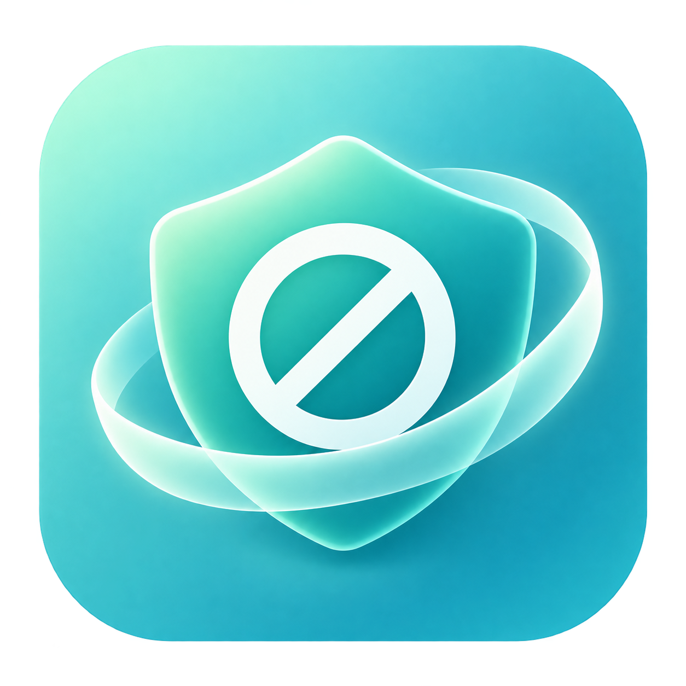
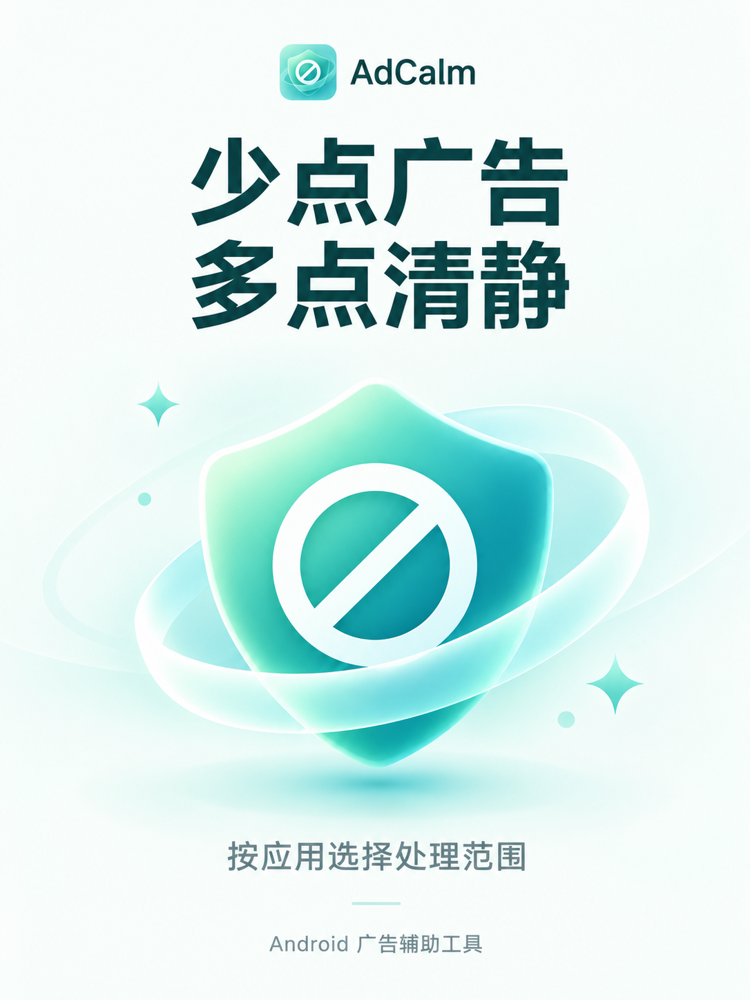

# AdCalm

**少点广告，多点清静。**

薄荷风格的 Android 广告辅助工具。通过无障碍识别与离线 OCR，尝试跳过开屏广告、关闭广告弹窗；支持按应用选择、误跳回退与下载隔离恢复。

[下载试用](https://github.com/NanCC-247/AdCalm/actions/workflows/ci.yml) · [源码版本](https://github.com/NanCC-247/AdCalm/releases) · [使用指南](docs/guides/使用指南.md) · [报告问题](https://github.com/NanCC-247/AdCalm/issues) · [更新记录](CHANGELOG.md)

| 简约体验 | 本机识别 | 回退与恢复 |
|:---:|:---:|:---:|
|  |  |  |

## 核心功能

| 功能 | 能做什么 |
|---|---|
| **广告跳过** | 结合页面节点、关闭文案和倒计时识别候选；节点信息不足时尝试离线 OCR。 |
| **范围可选** | 自行选择处理应用，支持搜索、筛选、批量选择和本机推荐。 |
| **误跳辅助** | 符合条件时尝试回退、返回原应用；可按设置与权限尝试强停目标。 |
| **隔离恢复** | 将标准下载目录中符合条件的可疑安装包移入隔离区，默认保留 24 小时，期间可以恢复。 |
| **手动清理** | 借助 Shizuku 扫描候选安装包，由用户审核并确认删除；手动删除不可恢复。 |
| **状态与诊断** | 查看服务状态、操作统计和最近扫描时间；提供能力自检与纯观察模式。 |

仅有位置证据不会触发点击；输入法显示时暂停点击。纯观察的识别流程只记录结果，不执行自动点击、回退、强停或新增文件隔离。已隔离的文件仍按保留期限清理。

## 开始使用

当前公开版本 **v0.1.0 提供源码，尚无 APK 附件**。GitHub 的 Source code 压缩包不是安装包。可按[开发指南](docs/guides/开发指南.md)自行构建，或查看 [Actions](https://github.com/NanCC-247/AdCalm/actions/workflows/ci.yml) 中成功运行提供的临时 Debug 包；下载需要登录 GitHub，以对应运行的 Artifacts 为准。

安装后完成两步：

1. 按引导开启无障碍服务。
2. 在应用管理中选择需要处理的应用。

基础跳过无需 root 或 Shizuku。误跳与下载处置等增强功能按需配置权限，详见[使用指南](docs/guides/使用指南.md)。

## 兼容与限制

- 支持 **Android 8.0+**；截图 OCR 需要 **Android 11+**。
- 默认构建适用于 **ARM64** 手机，其他架构需调整构建配置。
- 效果受应用界面、系统版本和后台限制影响，无法保证处理所有广告或完全避免误判。
- 无文字、无可靠节点信息的关闭按钮可能无法识别。
- 操作统计记录已发起的点击，不代表每次广告都已成功关闭。

## 隐私与权限

核心识别在本机完成，不通过服务器处理界面内容。主动下载 Shizuku 时会联网，可能经第三方镜像获取，安装仍需系统确认。

诊断记录可能包含应用名称、屏幕文字、节点树和截图。仅在排查时开启，公开分享前检查并遮盖私人信息。权限用途、数据留存和文件恢复边界见[使用指南](docs/guides/使用指南.md)。

## 文档与参与

[统一文档入口](docs/README.md)

- [使用指南](docs/guides/使用指南.md)：开启方式、权限、观察模式、隔离恢复与问题排查。
- [开发指南](docs/guides/开发指南.md)：构建环境、测试和源码结构。
- [技术参考](docs/research/技术参考.md)：参考项目与技术取舍。
- [界面设计说明](docs/design/界面设计说明.md)：视觉风格与页面结构。
- [贡献指南](CONTRIBUTING.md)：提交问题、设备验证与代码改进。

采用 [GPL-3.0](LICENSE) 许可证。欢迎提交可复现的问题和改进建议；请在有权操作的设备上使用，并留意应用实际行为与相关服务条款。
